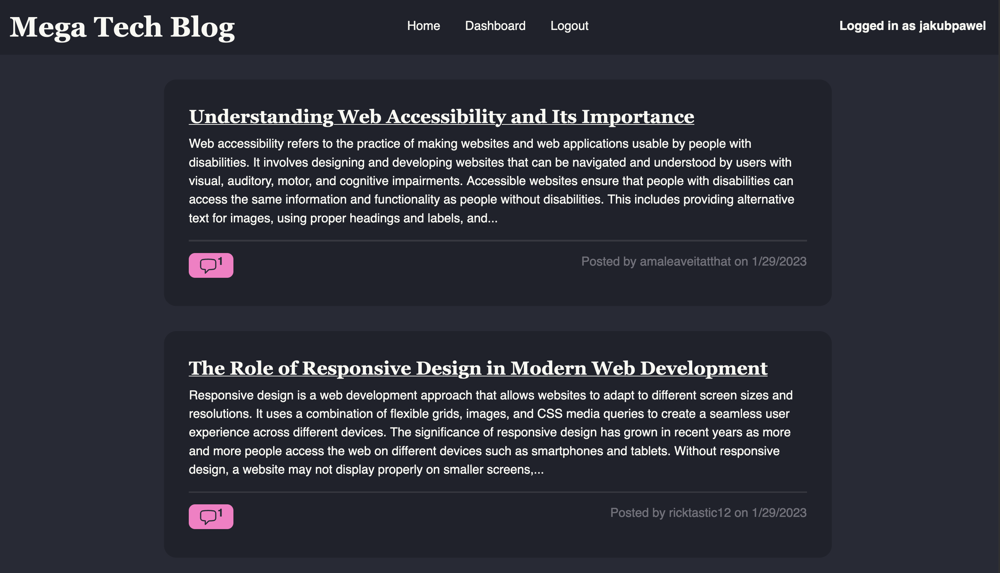
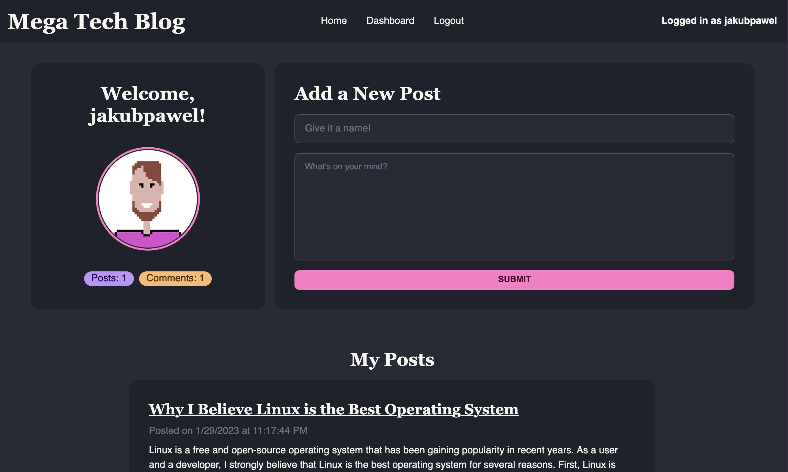
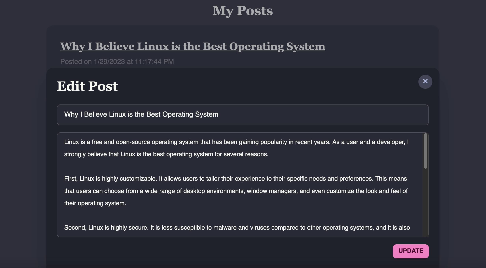
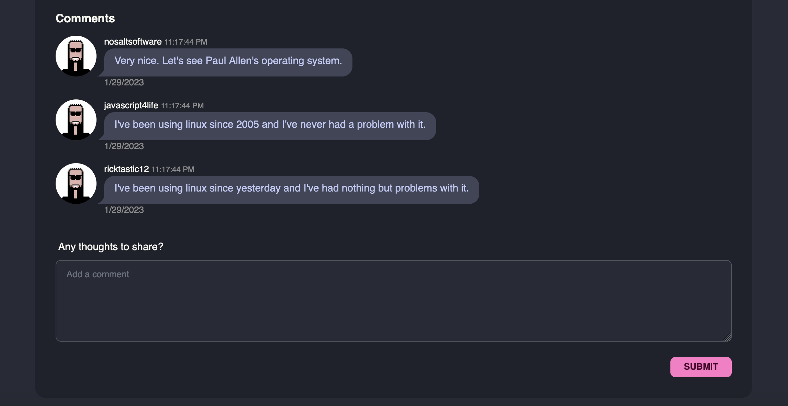

# Mega Tech Blog

 

 

## Table of Contents

- [Description](#description)
- [Usage](#usage)
	- [Create an account](#creating-an-account)
	- [Navigating the dashboard](#navigating-the-dashboard)
	- [Adding a new post](#adding-a-new-post)
	- [Editing and deleting posts](#editing-and-deleting-posts)
	- [Leaving comments](#leaving-comments)
- [Future Development](#future-development)
- [Credits](#credits)
- [License](#license)

## Description
Mega Tech Blog is an online micro-blogging platform focused on technical discussions relating to web developement, devops, and security. Users can create an account, login, and post about their experiences with various technologies or their thoughts on anything tech-related. Users can also comment on other users' posts. This application is built with the **MVC** paradigm and is deployed on Heroku. It is built using **node v16.18.1** and the **MEHN** stack (MySQL, Express, Handlebars, and Node.js). It can be accessed [here](https://mega-tech-blog.herokuapp.com/).
 

## Usage
When you load the [web application](https://mega-tech-blog.herokuapp.com/) you'll be on the homepage where you can view previews of all the posts on the platform. If you click on a post title or the comment button, you can view it on its own page and read the rest of the post. Comments are also visible on each posts' page. You can only leave a comment if you're logged in. You can click on the **Login** button in the navbar to login to your account. If you don't have an account you can create one by clicking the **Sign Up** link on the log in form. Once you have logged in you will be redirected to the dashboard. You can manage your posts on the dashboard. You can go back to the homepage by clicking the **Home** link in the navbar. 
 

### Creating an account
To create an account, click the **Sign Up** link on the login form. You will be prompted to enter a username and password. The minimum password length is 8 characters. Once you have entered your information, click the **Create Account** button. You will be redirected to your dashboard.
 

### Navigating the dashboard
The dashboard is where you can view your posts, add new posts, and edit or delete existing posts. There is a user profile card on the dashbaord that contains your username, an avatar and some of your stats. Next to this is the **Add a New Post** form. When you submit your post it will be added to the dashboard and to the homepage so other users can read it. Below the **Add New Post** form is a list of your posts with the newest entries on top. You can click on the **Edit** button on each post card to update the post title or contents and click the **Delete** button to delete the post. If you click on the title of the post you will be redirected to the post's page where you can view the post and comments. You can also add comments to the post from the post's page.
 

### Adding a new post
Simple! Just fill out the **Add a New Post** form and click the **Submit** button. The dashboard page will reload and you can see your new post now. You can also see your new post on the homepage.
 

### Editing and deleting posts
To edit a post click the **Edit** button on the post card. This will pop up a form where you can edit the post title and contents. Once you have made your changes, click the **Update** button. The dashboard will reload and you can see your updates instantly. To delete a post, click the **Delete** button on the post card. This will delete the post from the database and remove it from the homepage and the dashboard.
 

### Leaving comments
To leave a comment on a post, click the title of the post or the pink comment button the the left hand side of the post card. This will redirect you to the post's page where you can view the post and comments. At the bottom of the page is a text area where you can leave a comment. Once you have entered your comment, click the **Submit** button. The page will reload and you can see your comment at the bottom of the page. 
 

 

If you are not logged in, you will see a warning message telling you to login to leave a comment and links to the login and singup pages.

## Future Development
- [ ] Preserve white space in displayed post contents so that paragraphs are not all squished together
- [ ] Add a confirmation dialog for deleting posts
- [ ] Add custom alerts for incorrect login credentials, username already exists, etc.
- [ ] Allow users to upload an avatar image, currently the avatar is a [random placeholder image](https://xsgames.co/randomusers/).
- [ ] Add a password reset feature
- [ ] Add a search bar to the homepage to allow users to search for posts by title or content

## Credits
This application uses the following open source technologies:
- [Handlebars templating engine](https://handlebarsjs.com/)
- [TailwindCSS for styling](https://tailwindcss.com/)
- [DaisyUI components](https://daisyui.com/)
- [Express web framework](https://expressjs.com/)
- [Express Handlebars](https://www.npmjs.com/package/express-handlebars)
- [Express Session](https://www.npmjs.com/package/express-session)
- [Connect Session Sequelize for session storage](https://www.npmjs.com/package/connect-session-sequelize)
- [MySQL database](https://www.mysql.com/)
- [MySQL2 client for node.js](https://www.npmjs.com/package/mysql2)
- [Sequelize ORM](https://sequelize.org/)
- [Bcrypt for password encryption](https://www.npmjs.com/package/bcrypt)
 

## License

This application is covered under the [GNU GPLv3 License](https://choosealicense.com/licenses/gpl-3.0/).
